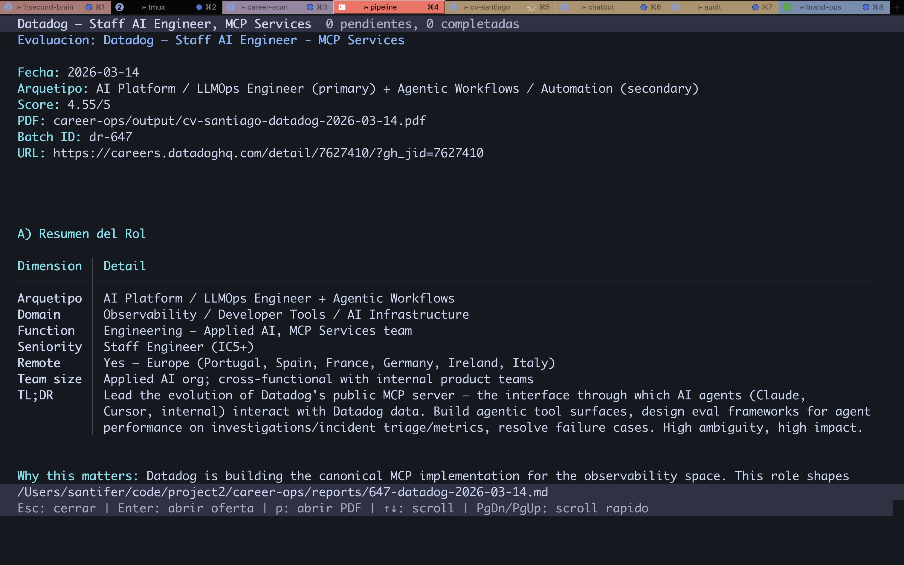
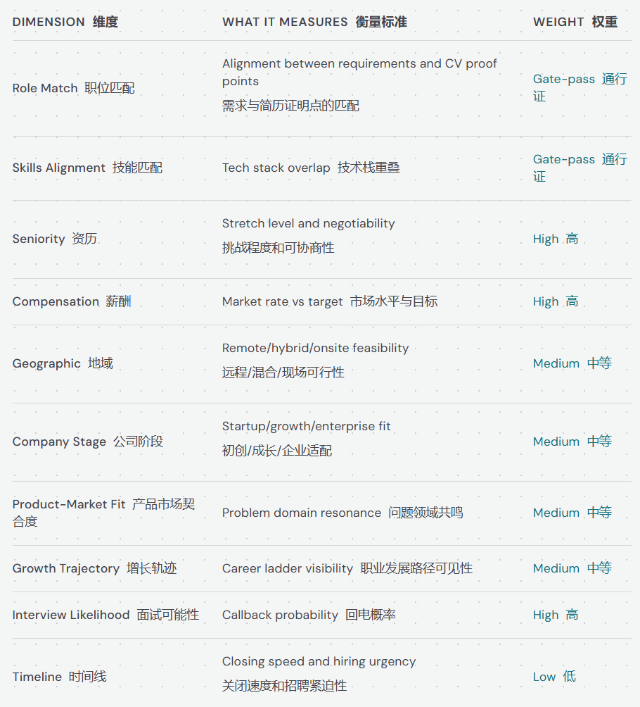
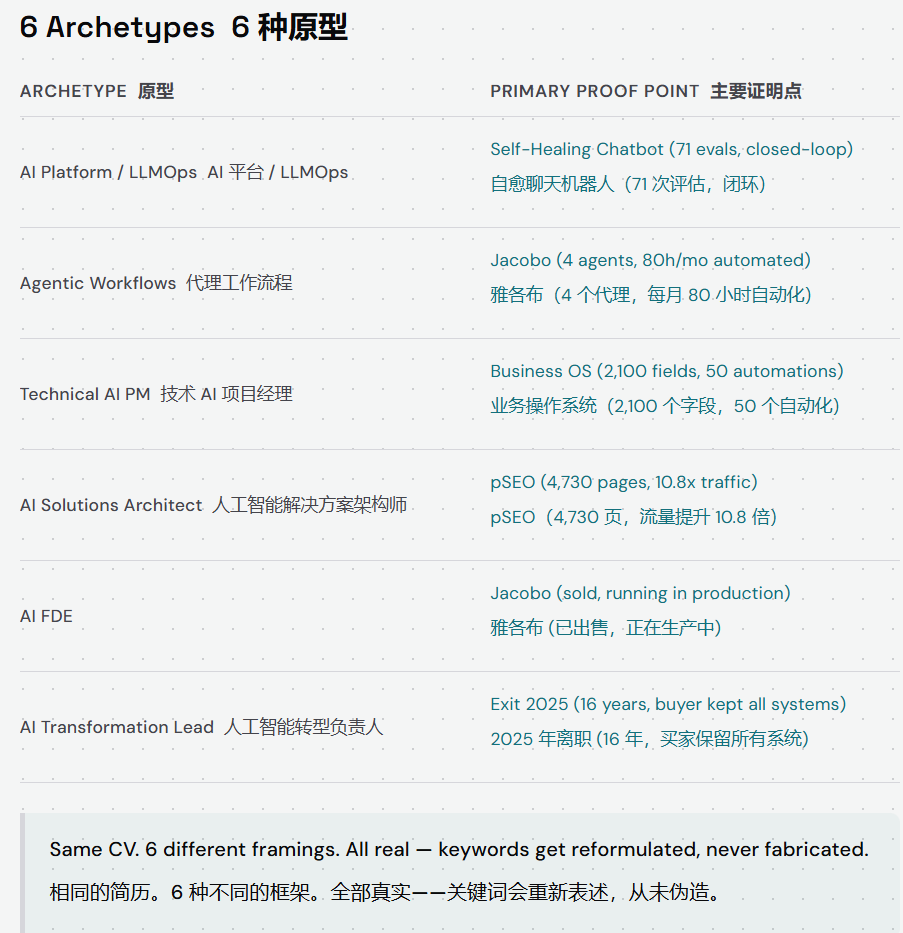
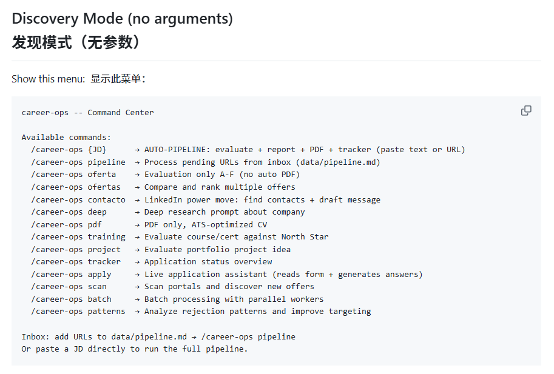
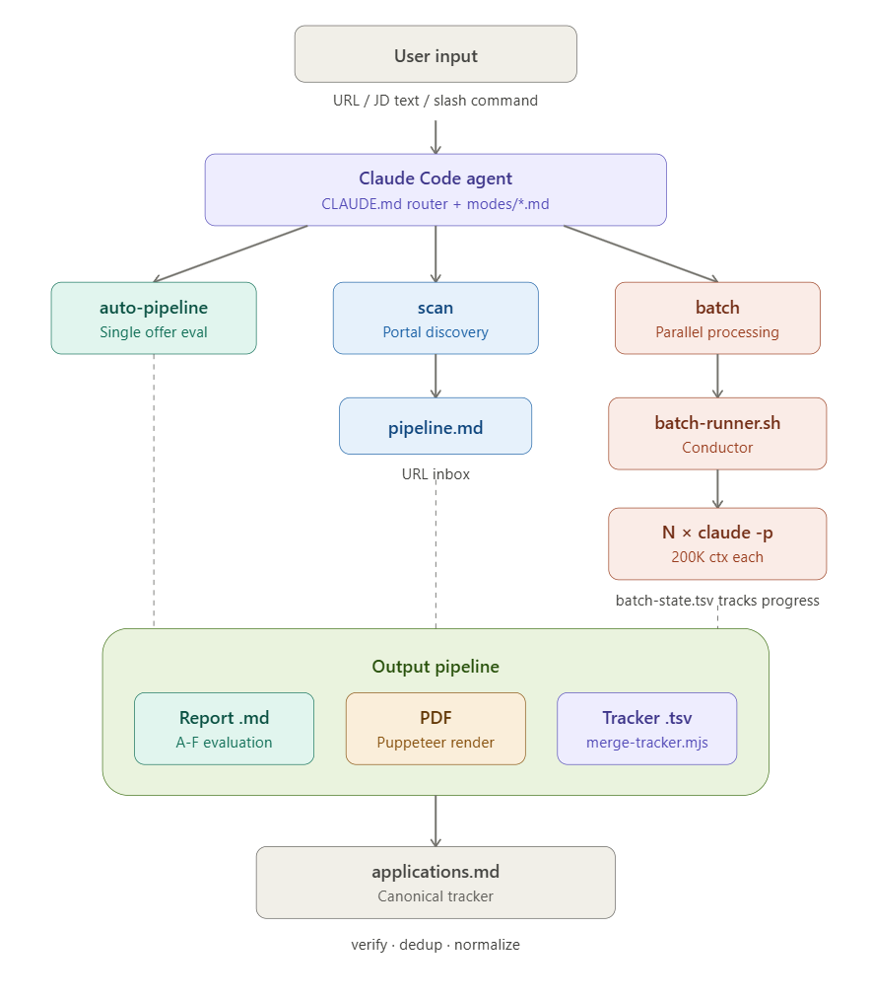

GitHub 上有个新项目，2天斩获2万 star。

作者 Santiago 在找工作时，用它评估了 516 个岗位、生成了 631 份报告、最终投递 68 份，拿到了 Head of Applied AI 的 offer。

它吸引我的不只是结果，而是背后的两件事：**他对求职流程的系统化思考，以及他用 Claude Code 构建多智能体协作的方式。**

---

## 求职的系统化思考

### 找工作包含大量的重复劳动

Santiago 的核心洞察很朴素：求职中 70% 的工作是重复的分析劳动，而不是决策。读岗位描述、映射自己的技能、判断匹配度、改简历、填表单，这些动作每个岗位都要重复一遍。

他的数据也验证了这一点：631 份评估报告中，74% 的 offer 得分低于 4.0（满分 5.0）。也就是说，如果没有系统化筛选，大量时间会花在根本不合适的机会上。

### 评估框架先于行动

他设计了一套 10 维加权评分体系，其中角色匹配和技能匹配是最关键的指标——不匹配直接 pass。其余维度包括资历、薪酬、公司阶段等。

这个框架的价值在于：把"什么是好机会"从直觉判断，变成了可执行的结构化标准。

### 简历是论证，不是文档

他不是拿着一份简历到处投，而是基于每个岗位动态生成简历：从岗位描述中提取 15-20 个关键词，识别岗位属于 6 个工作方向中的哪一个，然后按相关性重排经历的优先级制。

同一份经历，不同的框架。他的原则是：**什么都不编造，只是让最相关的证据出现在最显眼的位置。**

---

## 用 Claude Code 构建这套系统

### 多个模式，只用一个 Skill 路由

Santiago 采用了渐进式披露的方式：把所有指令放进 `CLAUDE.md`，统一通过 `career-ops` skill 进行路由，再按模式注入额外参数。

`modes/` 目录下有 14 个 `.md` 文件，负责精准的动态上下文注入。这给了我一个启发：**并不是所有内容都要设计成 skill，直接作为 MD 文件保存在项目里，需要时注入调用就够了。**

### AI 做推理，脚本做确定性

AI 擅长评估和生成，但数据合并、去重这类需要确定性结果的操作，Santiago 选择用传统脚本来做——`verify-pipeline.mjs` 负责监控检查，`dedup-tracker.mjs` 按 `company+role` 去重。

同一个岗位可能在不同平台多次发布，他的实践中共发生了 680 次重复 URL 的去重。这件事比任何评分优化都能节省更多时间。

### 批处理：粗暴但可控的并行

Santiago 没有用 Claude Code 自带的 `/batch`，也没有设计 sub-agent 来完成批量调用。他的方案更"粗暴"：用 `batch-runner.sh` 通过 tmux 同时开多个会话，每个会话跑一个 `claude -p`，再用 `batch-state.tsv` 追踪谁完成、谁失败。

sub-agent（Task 工具）是在同一个 Claude Code 会话内部派生子任务，共享上下文窗口，受主进程调度；`claude -p` 则完全绕过会话管理，在操作系统层面用 bash 做进程编排。代价是每个 worker 需要手动事先编排好上下文——但好处是并行度和容错性更强。

---

## 对我的启发

Career-Ops 让我看到的不只是一个求职工具，而是一种用 Claude Code 构建领域系统的方法论——把复杂工作流拆成独立的 mode 文件，用路由表分发而非堆砌 skill；AI 做推理和生成，脚本做确定性操作，各取所长；批处理用 conductor-worker 模式， worker prompt 自包含，文件系统做通信。

这些经验不只适用于求职场景——但可以迁移的是思维方式，不是这套工具本身。
