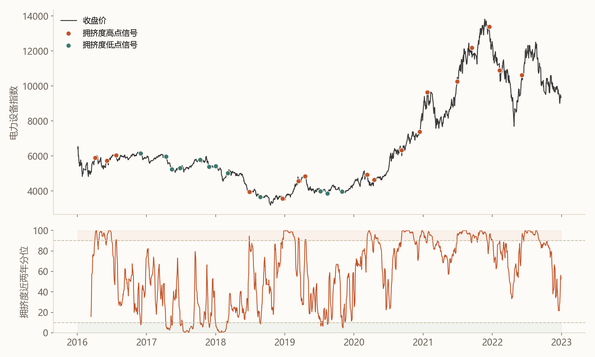
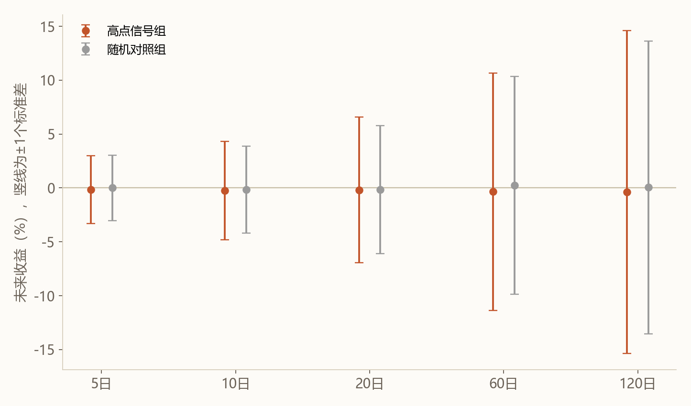
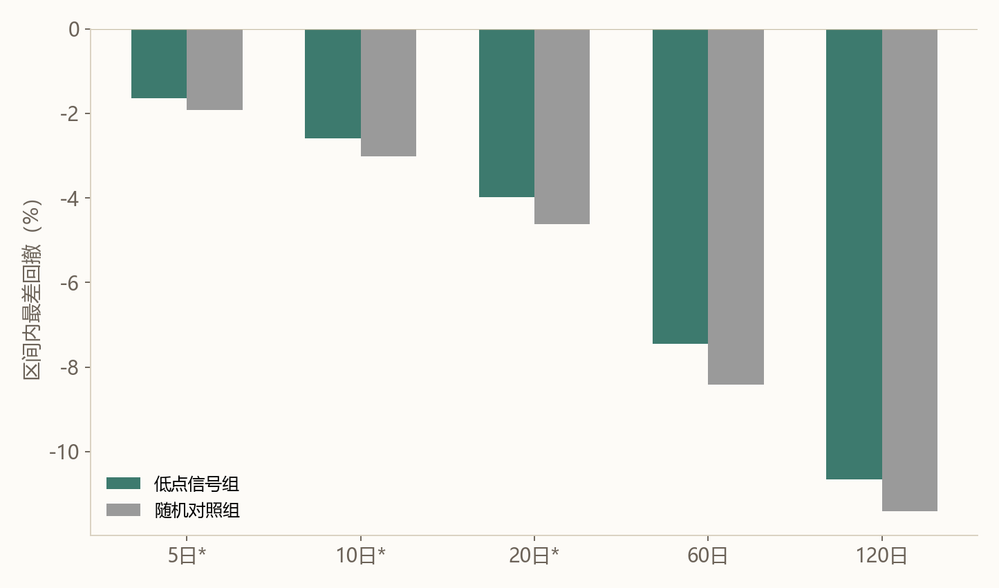
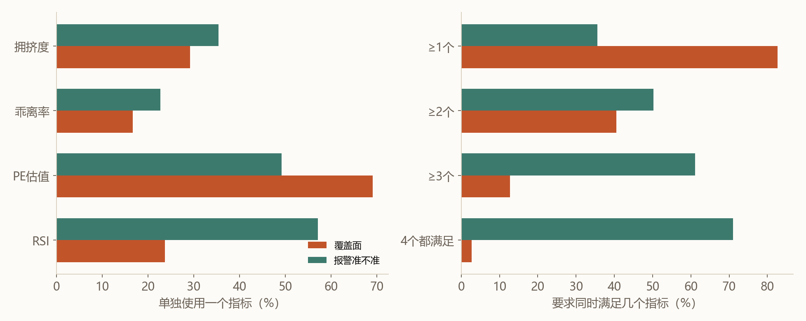

前几天写完那篇关于八年前资金面周报的文章后，我一直惦记着一个更具体的问题：那些券商报告里"某板块成交额占比冲到近两年高位，往往是阶段性顶部"这类判断，到底能不能当真？这句话几乎是每一份行业轮动研报的标配句式，听得多了，我开始怀疑自己是不是从未真正验证过它，只是因为它符合直觉——"太挤的地方，早晚要出事"——就默认接受了。

于是我们拿天风证券当年一篇讨论TMT成交占比的报告作为起点，把这句定性判断翻译成了一套可以回测的规则，在2014到2026年的A股全部32个申万一级行业上认认真真跑了一遍。过程比我预想的要曲折，结论也比我预想的要朴素。

------

"抱团"是什么，其实没那么复杂
---

一个板块被"抱团"，说白了就是某一天全市场一共成交了多少钱，这个板块自己占了多大比例。比例越高，说明相对更多的钱这一天都挤在了同一个筐里。把这个比例每天记一遍、取5日均值抹平噪音，就得到一条可以长期跟踪的曲线。

但光看这个比例的绝对数字没什么意义——3%对光伏板块可能是冷清，对家电板块可能已经是历史级别的疯狂。真正有意义的问题是：这个比例放进过去一两年的所有交易日里排名，算不算数得着的高。这就像儿保科体检报告不会直接告诉你"188厘米算不算高"，而是告诉你"在同龄人里排第90百分位"。我们对拥挤度做的是同一件事：把"排在过去两年最热的前10%"定义为一次高点信号，"排在最冷的后10%"定义为一次低点信号——研报里那句定性判断，就这样被翻译成了一条能验证的规则。

------

这句话，经得起回测吗？
---

光挑几个印象深的案例讲故事是不够的，那样太容易自己骗自己。我们把12年里全部32个板块触发过的高点信号和低点信号都找出来，一共1600多次，再从全部普通交易日里随机抽一批"什么都没发生"的日子做对照组——如果信号组的后续表现和随便挑的普通日子没有差别，这套规则就是自欺欺人。

先拿电力设备（新能源、锂电的主战场）2016到2022年这一段热热身，把价格和信号点画在一起：

上图橙点是高点信号，青点是低点信号，下方是拥挤度在近两年里的排名。2021年这一轮真正的历史大顶出现在11月，价格摸到过13800附近；拥挤度最后一次报警定格在12月16日，价格已经回落到13393——离顶点不算远，但这是顶部形成一个月之后的事后确认，不是提前预知。再看2018年年初：全年下跌的电力设备，年初收盘价恰好是全年最高，但当时拥挤度只排在后6%，指标完全没有被这个"假高点"骗到。两件事放在一起看，大概就是这套指标真实的样子：不算精准，但也不是瞎报警。

把全部1600多次信号和对照组放在一起算，我们想知道三件事，答案一个比一个反直觉。

抱团抱到最热之后，收益会明显变差吗？看不出来。信号组之后的平均收益确实都是负的，方向和研报说的一致，但摆出误差范围一比，这点差距完全被淹没——就像两个人身高差2厘米，但测量误差有正负30厘米，谁也说不清谁更高。

抱团抱到最热之后，会变得更颠簸吗？会，尤其是接下来2到4周。这是这次回测里最站得住脚的一条结论，换了好几种参数、好几个时间段重新测都没变过。

两组的点几乎贴在一起，这是"看不出来"的意思；但橙色的竖线在10天、20天窗口明显比灰色更长，波动被真实地放大了。

冷清到极值之后，会更抗跌吗？短期是的，但只撑得住一个月。

前三组（打星号的5/10/20天）青色柱子明显比灰色短，这个差异站得住脚；后两组几乎一样长——短期的抗跌优势，撑不到三个月以后。注意这只是说"没那么容易再跌"，不代表"接下来会涨"，这是两回事。

------

我们想让它更准，但一次次落空
---

拿到这三条结论后，我们不甘心——"波动会放大"固然有用，但更想知道的是能不能卡准一点，别老是马后炮。接下来几次尝试，说实话都没有达到目的，但过程本身比结论更值得记录。

我们先把"和过去两年比"换成"和自己最近三个月比"，指标对短期变化确实更敏感了、报警次数也变多了，但六个热门板块里五个板块"真正的历史顶点附近仍然没有信号"这个现象依然存在——换一种量尺，没有改变拥挤度的极值点和价格的极值点本来就不同步这个底层事实。我们又叠加了估值贵不贵、动量是不是涨过头两把尺子，要求同时报警才算数：高点这边，"一起报警"确实让波动放大的结论更清楚了；但低点这边出了一个没预料到的反面结果——本来单纯冷清之后短期还有点抗跌效果，一旦要求三重确认，这个优势不但没加强，反而消失了，后续表现还更差。我们怀疑这种叠加筛出来的可能不是"超跌待反弹"的票，而是"没人要、便宜也没人捡"的票，这只是个猜测，没有证据坐实，但足以提醒自己：不是确认条件越多越保险，得分开验证，不能想当然。

最亮眼的那条发现——"多指标一起报警后波动放大更明显"——我们又换了四个历史阶段分别重新测，结果只有2021到2023这一段特别显著，2014到2017几乎测不出来。更可能的解释是那几年市场本身格外剧烈，不是这套方法真的更准，只是赶上了一个特别配合的年份。我们把要求提到最高，拥挤度、估值、动量三个指标同时确认，12年里全市场一共只出现过13次，直接拿这13次报警当天的价格去查：往前后各放宽一个月看，只有1次真的是那个月里的最高价；放宽到前后三到六个月，一次都不是。三次尝试之后，我们承认了一件事——拥挤度这个维度，本身就做不到精确卡顶，换算法、叠指标、换时间段都没能改变这一点。

------

换一个更谦虚的问题
---

既然精确抓顶这条路走不通，我们把问题换了一个更谦虚的版本：不再问"这一天是不是最高点"，而是问"现在算不算处于近两年少见的高位区间"。这就像天气预报报暴雨预警，不会告诉你哪一分钟会下最大的雨，但会提醒你今天出门带把伞——容忍多报警几次没关系，但不希望真正的高位区间被漏掉。

换了目标之后，我们把四个指标摆在一起重新打分：拥挤度本身、拥挤度相对自己短期均线的偏离、估值分位（贵不贵）、以及RSI（一个常见的技术指标，衡量涨得是不是过猛）。

左图能看出估值分位数覆盖面最广——真正的高位区间里，69%的日子估值也同时排在近两年前10%，这符合直觉，炒上历史高位的板块，估值大概率也被顶到历史高位。RSI报警准不准最高，一旦超买，过半概率真是处于高位区间，但它比较高冷，只能抓到24%的高位区间。拥挤度和它的短期偏离单独看都只能算中等。右图是把要求逐步收紧的结果：越松抓得越全但越容易误报，越严可信度越高但漏掉的也越多。"至少两个指标同时满足"是一个比较均衡的点——能覆盖40.5%的高位区间交易日，报警时真的处于高位区间的概率过半，我们把这条当作目前最实用的预警规则。

光看统计数字还不够踏实，我们又挑了几个板块历史上真正的情绪大顶，和一个"技术性最高点"（价格确实是当年最高，但只是因为那年一路下跌、年初恰好垫底）做对比：

| 板块 · 年份 | 拥挤度分位 | 短期偏离分位 | PE分位 | RSI |
|---|---|---|---|---|
| 电力设备 · 2020（真高点） | 98.2 | 82.2 | 100.0 | 68.4 |
| 食品饮料 · 2021（真高点） | 98.2 | 67.6 | 100.0 | 74.1 |
| 国防军工 · 2026（真高点） | 100.0 | 96.6 | 100.0 | 91.2 |
| 电力设备 · 2018（技术性最高点） | 6.0 | 16.6 | 5.8 | 53.5 |

前三行是真正的历史性大顶，四个指标几乎全部逼近或达到100，齐刷刷地"发烧"；最后一行那个技术性最高点，四个读数全部偏低，没有一个指标被这个价格幌子骗到。这套组合规则不是见到新高就乱报警。

------

回到今天
---

这套框架现在每个交易日都在跑一遍全市场32个板块。就在写这篇文章的今天，2026年7月17日，有两个板块同时踩中了两个以上指标：

| 板块 | 拥挤度分位 | PE分位 | RSI |
|---|---|---|---|
| 半导体 | 99.0 | 90.8 | 35.8 |
| 电子 | 97.2 | 90.8 | 34.6 |

值得注意的是，这次报警靠的是抱团热度和估值，RSI还不到36，远没摸到70的超买线——说明这一波更像是钱和估值都在往前挤，还不是短线情绪最亢奋的那种冲高状态。再查一下历史，过去11年这两个板块一共出现过120次类似报警，报警期间板块本身涨跌幅的中位数是+1.1%，收正的次数占了65%。这组数字提醒我一件事：这类报警经常在板块继续走强的过程中就响了，并不是非要等到真正见顶那一刻才响。眼下电子从4月14日报警至今累计涨了20%，半导体从6月15日报警至今累计跌了5.5%——同一套规则，两个板块给出的走向截然相反，这本身就是对"报警不等于必跌"最直接的提醒。

------

拥挤度是体温计，不是导航仪
---

写到这里，我发现这篇文章和上一篇关于资金面数据的文章其实在讲同一件事。资金面数据记录的是市场已经完成的行为，拥挤度记录的是资金此刻的集中程度，两者本质上都是同步甚至滞后的镜子，而不是预知未来的望远镜。把这句话认真验证下来，我最大的收获，不是找到了一个更精准的择时工具——恰恰相反，是确认了这类工具根本不该被拿来做精确择时。它能可靠告诉你的，只是"现在是不是处于历史上少见的高热区间"，仅此而已。至于哪一天见顶、该在哪天卖，12年数据、十几次不同角度的尝试，都没能给出答案，这大概不是我们方法不够聪明，而是这类信号天生就不携带这个信息。

真正有用的用法，可能只是把报警当成一次提醒：如果你已经在场内，这更像是系好安全带，而不是立刻下车；如果你在观望，它至少能帮你把"这个板块是不是已经很挤了"这件事，从一种模糊的直觉，变成一个可以查证的数字。

至于哪天见顶——这件事，还是留给运气和后视镜吧。

*本文基于对2014–2026年A股32个申万一级行业历史数据的量化回测，方法上采用随机对照组与多组参数、多个历史时段的稳健性检验；文中标注"看不出来"的结论，均指统计检验下未达到常规显著性标准，不代表效应一定不存在。历史统计规律不代表未来一定重演，不构成投资建议。*
