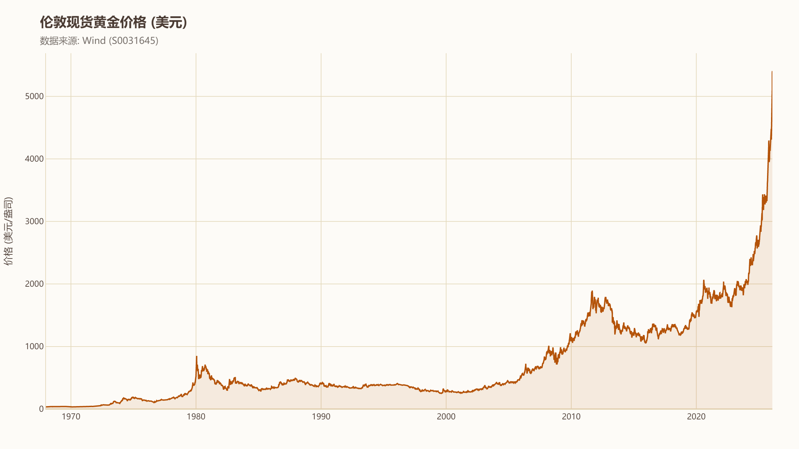
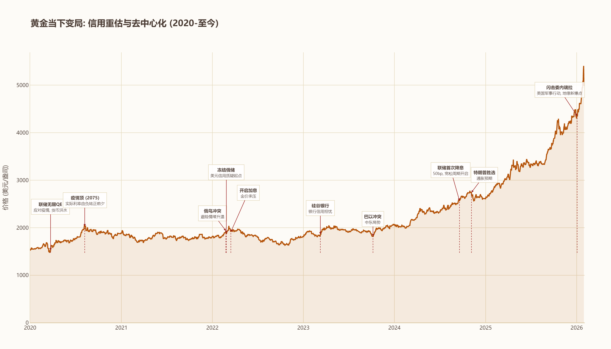
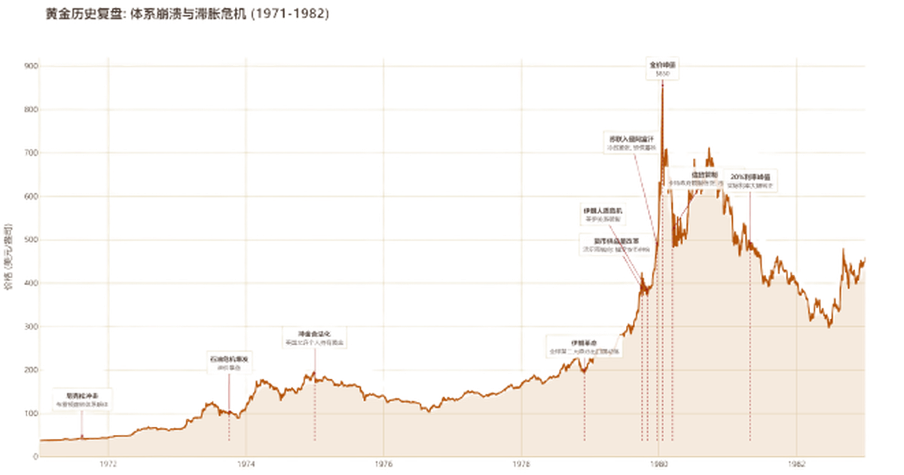
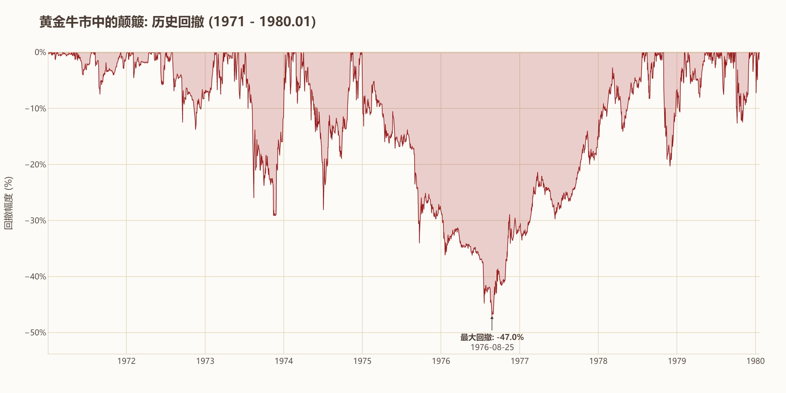
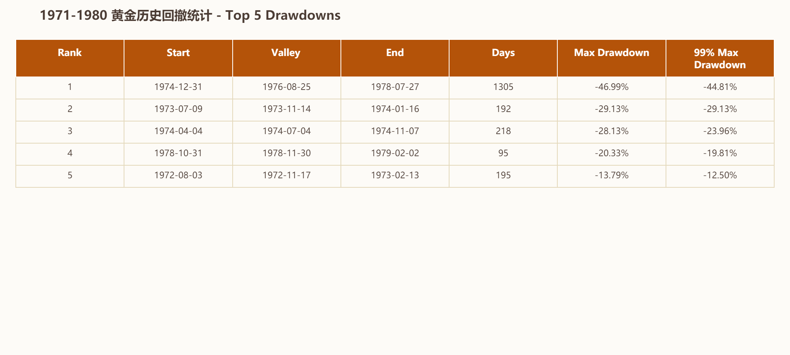
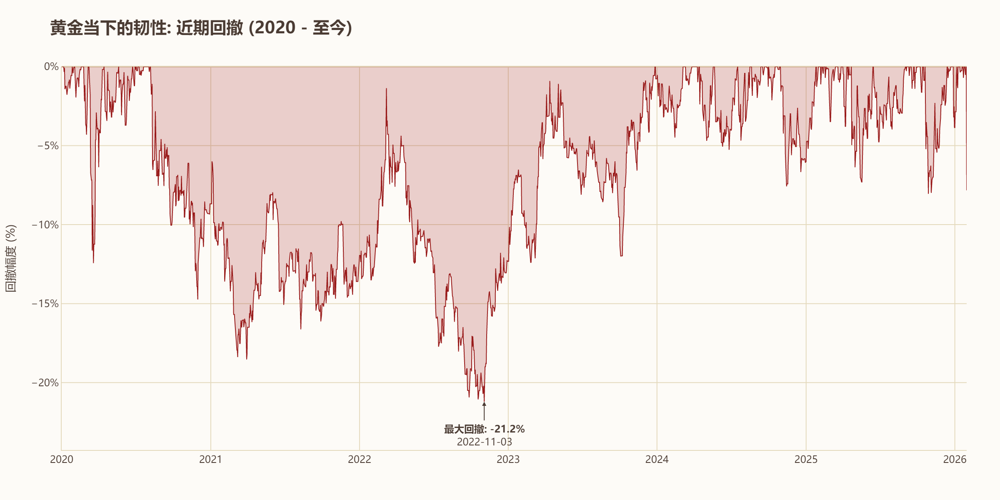
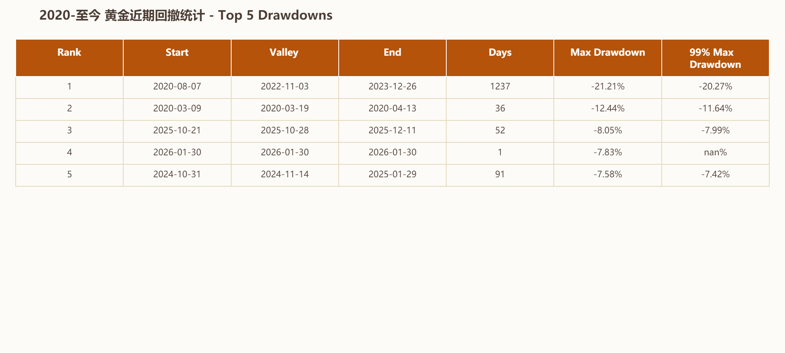

## 黄金当前的情况

黄金近期可谓高歌猛进,暴涨暴跌成为了市场的焦点,一度突破5300美元。

本轮黄金上涨的核心动力是美元信用遭到质疑。从2022年俄乌战争开始,黄金不再与美元实际利率呈现强负相关,美国加息也未能阻止黄金一路上涨。2026年以来,美国突袭委内瑞拉,美欧关系剧变,黄金屡创新高。

## 回顾历史:1970年代的黄金狂潮

历史不会简单重复,但总会惊人地相似。类似的情况在40多年前也曾发生:当时美元与黄金脱钩,苏联入侵阿富汗,两次石油危机爆发。让我们回顾一下当时都发生了什么。

1971年8月15日,由于美国深陷越战泥潭、财政赤字剧增,黄金储备已无法支撑固定汇率下的自由兑换,尼克松宣布美元与黄金的固定兑换关系被打破。旧的秩序虽未被彻底推翻,但在新规则下,全世界都在摸着石头过河。**1973年**和**1979年**,两次石油危机爆发,石油价格暴涨,造成了全球范围内的经济衰退和严重的通货膨胀。美元持续贬值,黄金作为传统的避险资产,成为对抗通胀的重要工具。

1979年,伊朗发生革命,推翻了亲美的国王。同年苏联入侵阿富汗,这被视为冷战升级的最危险信号,进一步加剧了全球的政治不稳定。黄金在1979年年底到1980年初的几个月间上涨了接近**100%**。1980年1月,黄金价格一度突破**850美元/盎司**,创下历史新高。

## 是什么导致了暴涨后的退潮?

1979年底,保罗·沃尔克(Paul Volcker)出任美联储主席,开始了针对高通胀的治理。1979年10月,美联储进行货币供应改革,不再紧盯"联邦基金利率",转而直接控制**货币供应量**。1980年3月实行"紧急信贷管制",严控货币供应,强行抽水。1981年5月,联邦基金利率被推高至**20%**的历史峰值。

这段时间中,虽然伊朗人质危机升级,"美国正在失控"的叙事仍然存在,推动了1980年的又一次上涨,但都已是"强弩之末"。沃尔克领导下的美联储成功重构了市场信心——美联储能够控制通胀,实际利率转正;伊朗人质获释,美国重新赢得冷战主动权。1985年广场协议签署,美、日、德、法、英决定联合干预外汇市场,诱导美元有序贬值——这标志着美国重新夺回了**对全球货币体系的主导权**。

## 总结

金银天然不是货币,但货币天然是金银。黄金在健康的布雷顿森林体系下,只是美元的影子。1970-1980年黄金暴涨的底层逻辑是**"美国失控"**,具体包括信用坍塌、通胀脱轨、霸权衰落,黄金作为最后的货币,逐渐从幕后走向台前。在此之后,世界秩序经历了全方位的重组,世界回到美国主导的轨道,黄金又一次成为了美元的影子。

## 历史数据对比

最后,让我们对比一下这两个时期黄金的最大回撤数据。

**1971-1980年:**

**2022年至今:**

