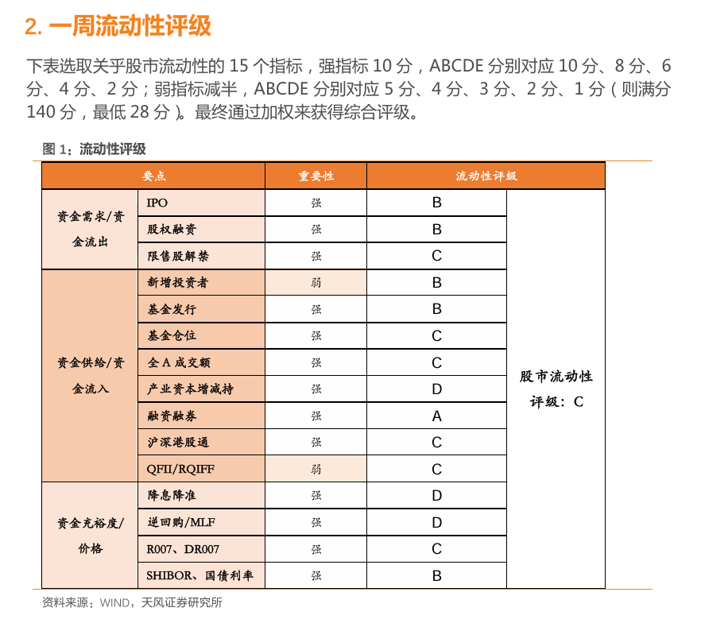

最近我翻出了几份2018年的券商策略研报——天风证券刘晨明团队的「一周资金面及市场情绪监控」系列。距今将近八年，A股经历了2018年的熊市、2019年的反弹、2020年的疫情冲击、2021年的结构牛，再到之后漫长的调整。拿着这些当年的"实时数据"回头看，我有一些与当初截然不同的感受。

------

专业系统的流动性监控框架
---

这套框架涵盖15个指标，覆盖资金需求、资金供给、货币价格三个维度，从IPO抽血到北上资金、从SHIBOR到产业资本增减持，每周更新，每个指标给出A到E的评级，最终加权得出"股市流动性综合评级"。

从2018年3月的C级，到2018年8月的B级，再到2019年2月的B级——每一次评级背后都有清晰的逻辑支撑。3月是因为货币偏紧、产业资本持续减持；8月是因为央行开始降准、北上资金逆势流入；2019年初则叠加了社融超预期放量的信号。

这套体系的完整性和自洽性，放在今天依然值得学习。

------

这些数据，当时真的帮到人了吗？
---

如果我们开着倒视镜回看当时的报告以及当时的市场，会发现。

2018年是A股当时调整的起点，2018年初市场延续2017年蓝筹行情冲高，在春节特朗普签署对华301调查备忘录，引起中美贸易战的恐慌，A股应声大跌。当时的流动性报告评价长期是C，而2018年8月，报告给出B级评级，当时北上资金持续流入，货币政策转松，各项指标改善明显。但上证指数从那时起继续跌了将近半年，一直跌到2019年1月才见底。如果你在8月看到B级评级就认为"流动性改善，可以加仓"，那接下来几个月的体验并不会太好。

这不是在批评报告本身——报告从未声称自己是择时工具。但问题是，**大多数读报告的人，心里期待的恰恰是某种择时信号。** 这是报告的功能与读者期待之间的结构性错位。

------

资金面数据的本质：一面记录过去的镜子
---

回头想想，这件事其实并不奇怪。

成交量、换手率、融资买入额——这些数据记录的是市场参与者**已经完成的行为**。北上资金本周净流入多少亿，说明的是外资上周买了什么，而不是下周会买什么。基金发行量高，说明的是现在情绪乐观，而乐观情绪恰恰是在市场已经涨了一段时间之后才产生的。

换句话说，资金面数据天生是同步的，在很多情况下甚至是滞后的。**用它来预判方向，是对它能力边界的误读。**

------

那么，它在哪里真的有用？
---

经过这番翻看和反思，我认为资金面数据的价值主要体现在两个地方。

**第一，判断当前所处的宏观流动性环境。** DR007、SHIBOR、国债收益率的水位，决定了整个市场的定价环境。资金便宜的时候，市场可以容忍更高的估值；资金昂贵的时候，高估值股票的压力会系统性增大。这不是择时，是理解市场背景的基础底层，需要长期跟踪，而不是单周数据的涨跌。

**第二，识别情绪的极端状态。** 这是我认为资金面数据最有价值的地方，但它指向的不是"方向预判"，而是"风险感知"。

当融资余额占流通市值的比例跌破某个历史低位，当新基金发行几乎停滞，当成交量萎缩至冰点，当产业资本开始大规模净增持——这些信号叠加在一起，说明的不是"明天会涨"，而是"市场已经把悲观情绪定价得相当充分了"。反过来，当爆款基金频出、融资盘快速攀升、大宗交易折价率消失——这不是涨势结束的精确时点，但它提示你应该开始认真审视自己的持仓风险。

**极值是提醒你调整心态的信号，而不是给你确定性答案的信号。**

------

我们真正需要的，可能比我们想象的少
---

八年前，一份合格的资金面研报需要追踪15个指标、每周更新数十张图表。今天，信息的获取成本更低了，数据的种类更多了，但投资者面对数据时的困惑，似乎并没有减少。

这让我觉得，问题可能不在于数据的数量，而在于我们与数据的关系。

我们总是希望数据能告诉我们该怎么做。但数据能做到的，其实只是帮助我们更清楚地看到当下的状态。把"看清状态"当成"预判未来"，是投资者面对数据时最常见、也最昂贵的一种误解。

真正有用的资金面框架，大概只需要三件事：持续感知货币环境的松紧，定期观察情绪指标是否走向极端，以及在极端信号出现时，保持足够的耐心等待基本面或政策面的共鸣。

剩下的那些图表，不看也罢。

------

*本文基于对天风证券刘晨明团队2018-2019年「一周资金面及市场情绪监控」系列报告的阅读与反思。*
