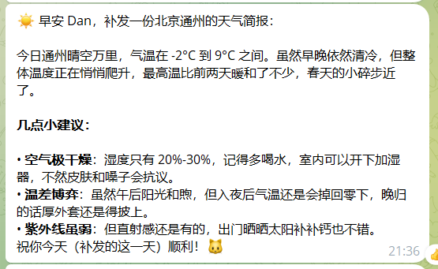
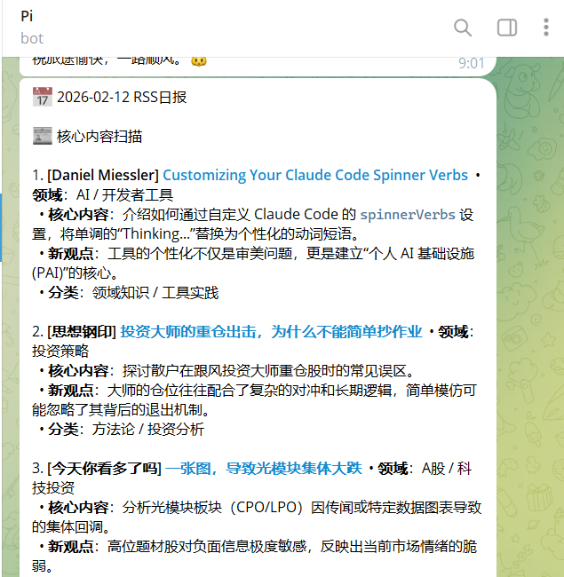
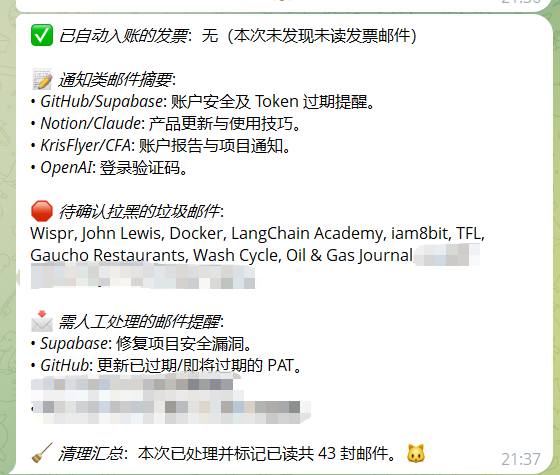
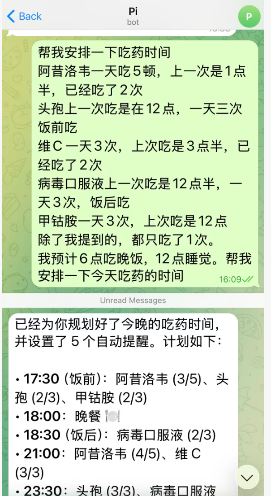
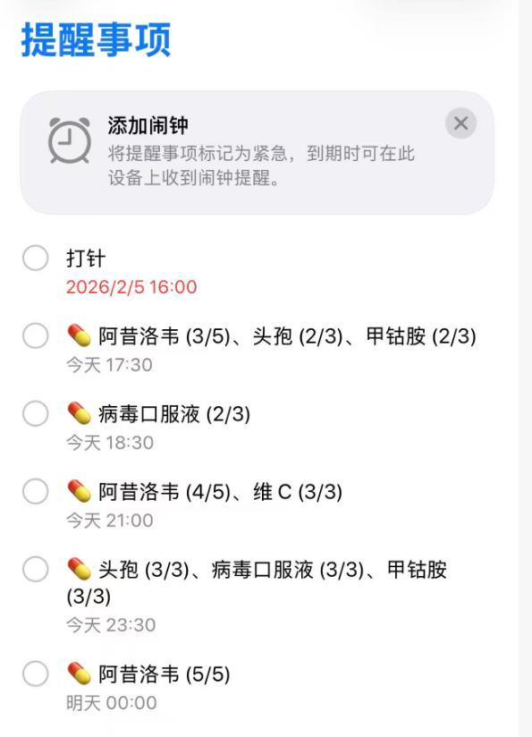
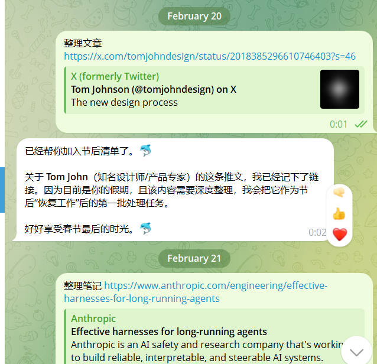
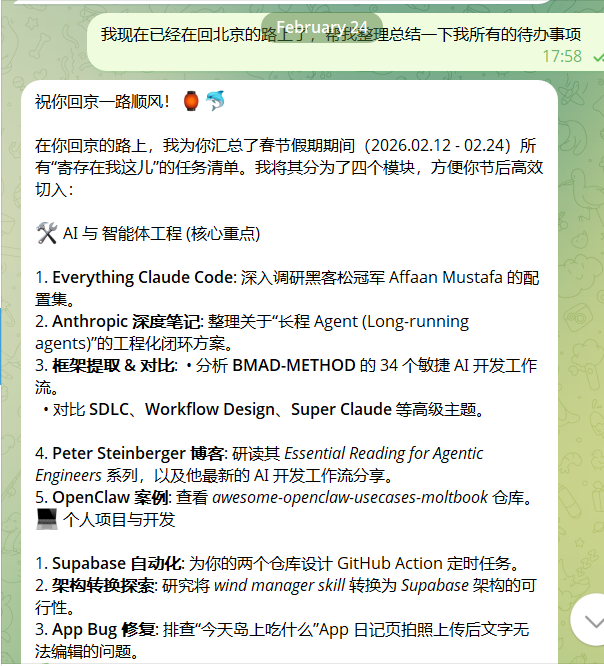
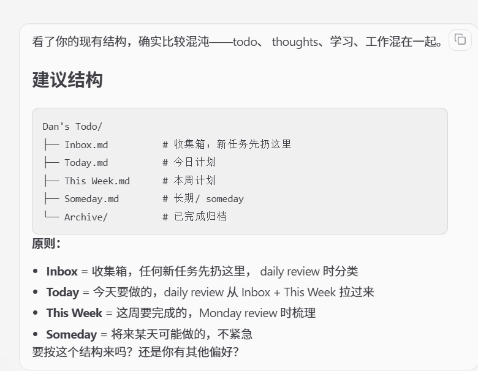

## 一、我曾对它不屑一顾

一开始，当我听说 OpenClaw 的时候，我只是认为它把 Claude Code 这样的终端 Agent 与手机、通讯软件做了一个连接。类似的功能并不新颖，也不难实现——早在一年前，我就将 N8N 与飞书机器人相结合，通过飞书便可以调用 Agent、定时执行任务。因此，我对它的态度是不屑一顾的。

后来，随着社区的讨论愈演愈烈，我也不禁好奇它到底有什么样的魔法。恰好，全网有大量的人因为 OpenClaw 专门购买了 Mac mini——我早已有一台 Mac mini，这成了让我真正动手部署的契机。

于是我开始尝试。而这一试，便一发不可收拾。

OpenClaw 不只是一个"工具"，它是一个真正的**个人助理**——一个可以不断进化、24 小时不下班的个人助理。

## 二、它是你不下班的个人助理

在手机上使用 Agent 的效率绝对不如在电脑上，这毫无疑问。但 OpenClaw 的定位恰恰不是要取代你的电脑工作流——它是**当你离开电脑后，依然能为你 24 小时工作的助手**。

### 定时任务：自动化你的日常信息流

我让它每天定时执行三件事：天气预报、RSS 日报推送、邮件处理。

**天气预报** —— 我不需要冰冷的数据告诉我"今天 5°C 到 12°C"。我真正关心的是：今天相比前两天有没有降温？穿多穿少？会不会下雨？以前，我需要打开天气 App，肉眼去对比今天和昨天的温度；而现在，它直接告诉我结论。

**RSS 日报** —— 我将关注的公众号和博客的 RSS 链接提供给它，让它编写了一个 RSS 日报的 Skill。每天，它自动抓取这些信息源最近一天的发文情况，给出初步摘要，让我快速判断：这些内容大概在说什么？有没有深度阅读的必要？

**邮件处理** —— 不知不觉中，我的邮箱里堆积了大量未读邮件。有些需要手动拉黑，有些应该列入待办，有些发票类邮件需要单独处理。OpenClaw 完美地执行了这一切：它帮我阅读邮件，对于不重要的邮件提醒我大概内容；在我的许可下拉黑推广邮件；更厉害的是，基于我设计的 Skill，它能自动处理发票类邮件——下载发票、识别内容、将信息写入我规定格式的 Excel 中。

### 随时响应：做你手边的行动力

除了定时任务，OpenClaw 真正让我惊喜的，是它随时可以响应的"行动力"——无论大事小事，开口就能处理。

**吃药提醒** —— 春节的时候，我身体有些不舒服，需要按不同频次、在不同时间点吃药。面对不同种类的药品、饭前饭后的区别，以及每天不同的服药频次，如果手动做计划，可能需要花个两三分钟。而我只是把需求通过语音转文字告诉了它，它便以极快的速度帮我完成了吃药规划，并且自动写入了苹果的"提醒事项"里。

这无缝的体验让我初步感到欣喜——这是 Claude Code 等终端工具无法直接完成的事情。

**碎片收集** —— 春节假期期间，我时不时会看到一些有价值的文章和视频。过去，我会把链接发送到微信的文件传输助手，等假期结束后再逐一查看。

有了 OpenClaw 之后，我可以将所有的链接与想法统统扔给它。假期结束后，它把我发给它的内容整理成一份完整的列表，储存在了我的 Obsidian 待办事项中。

**待办管理** —— 过去，我手动维护一份 To-Do List。现在，我让 OpenClaw 设计了一个全新的待办架构，自动区分"今天要做的"、"这周要做的"、"未来要做的"。我只需要用自然语言表达需求，它便帮我完善日志。

这些场景有一个共同特点：**它作为你的个人助理，可以处理你能想到的几乎一切生活琐事——节约你的时间，释放你的精力，让你专注于真正重要的事。**

OpenClaw 的创始人 Peter Steinberger 说**未来 80% 的软件都会消失**。天气软件、邮箱、资讯 App、Todo App、日历 App——我正在亲身经历这个过程。

## 三、不只是个人助理，更是对 Agent 的一次新探索

OpenClaw 是一个可用、好用的个人助理。但它让我想说的，远不止于此——它在 Agent 的理念上，给出了一些与众不同的声音。

### 它懂的是"你"，而不是"你的项目"

OpenClaw 区别于 Cursor、Claude Code 等编码 Agent 的核心差异在于：那些工具的上下文是你正在编辑的项目和工程——它们了解代码结构、函数调用、依赖关系。而 OpenClaw 掌握的，是关于**"你"这个人**的宏观信息。

它可能不知道某个项目的具体代码细节，但它比任何项目经理都了解你——你的习惯、你的偏好、你的日常安排。你的偏好被定义在 `soul.md` 与 `user.md` 这样的本地文件中，它在和你的每一次交流中不断学习、不断修正，越来越符合你的预期。这种"润物细无声"的进化，让它真正成为了**你的**助理，而不是一个通用的 AI 工具。

X 上甚至已经有人分享了更进一步的玩法：以 OpenClaw 为主 Agent，统筹调度 Claude Code、Codex 等编码 Agent 完成开发工作。OpenClaw 负责掌握项目目标与愿景的宏观上下文，编码 Agent 则专注于代码层面的执行——一个懂你，一个懂代码。

### CLI 优先：为 Agent 铺平道路

CLI 优先的理念并非 OpenClaw 首创，但 OpenClaw 将这一理念进行了进一步的发扬。可视化界面是给人看的，AI 在操作时直接使用命令行，效率远胜于模拟点击。这也是为什么 Peter Steinberger 表示 OpenClaw 并不支持 MCP——他认为一切工具都应该变成 CLI 工具（浏览器工具除外）。

而这背后有着更深一层的意义：**如果尽可能多的工具都以 CLI 的形式来构建，AI 就更有可能完成一个完整的 Agentic Loop。** 它可以自主调用工具、获取反馈、调整策略、再次执行——这意味着它具备了执行更长链任务的能力，甚至可以在执行过程中不断迭代和优化自身的方案。这才是 Agent 真正走向自主的关键基础设施。

## 四、Just Talk to It：在沟通中迭代

正如 Peter 在博客中提到的 **Agentic Engineering** 的理念——"Just talk to it"。使用 AI 的最好方法就是使用 AI。你越使用它，就会冒出越来越多的点子；你越使用它，便会逐步发现自己独特的需求。

而这里最核心的，不是某一个具体的 Skill 或功能，而是**你与 AI 不断沟通、不断迭代的过程本身**。你告诉它"这里不太对"，它帮你调整；你说"我还想加上这个"，它帮你扩展；你用了一段时间发现"其实我真正需要的是那个"，它帮你推翻重来。这个过程没有复杂的编程，没有复杂的测试——只是一轮又一轮自然语言的对话而已。

别人分享的 Skill 更像是一个 **idea**、一个起点。但真正让它变成你自己的东西的，是你与 AI 之间那些反反复复的沟通。正是在这个持续迭代的过程中，你的需求被一步步澄清，你的工作流被一点点固化，最终形成了一个真正贴合你的小产品。而你打磨出来的这些东西，会跟着你走得很远。

OpenClaw 不会是个人助理类产品的终局。它还很年轻，还有很多粗糙的边角。

但这恰恰是最令人兴奋的部分。

想想看：我们今天看到的，不过是 AI 个人助理的**第一个可用形态**。它已经能帮我处理邮件、规划吃药、整理待办、每天推送日报。那么一年后呢？当模型更强、工具链更成熟、Skill 生态更丰富的时候，它还能做什么？

而最美妙的是，**你今天做的一切都不会白费。** 所有的配置都是本地文件——`soul.md` 记录着你的性格与偏好，`user.md` 定义着你的基本信息，一个又一个 Skill 文件沉淀着你与 AI 共同打磨出来的工作流。这些不是锁死在某个平台里的数据，它们是**属于你的、可迁移的数字资产**。你与 AI 的每一次对话都在积累，打磨的每一个 Skill 都是这段关系的凭证——它越来越懂你，你也越来越会用它。

如果你和之前的我一样，对这类工具还半信半疑——我只有一句话想说：

**Just talk to it。**

不需要精心构思 prompt，不需要搞懂底层原理，只需要开口，只需要行动。越尝试，冒出的新想法就越多；新的思路越多，生活也就越有趣。
