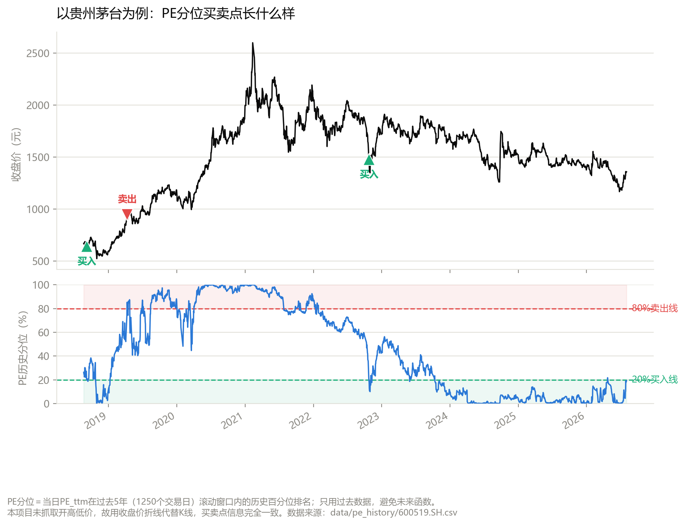
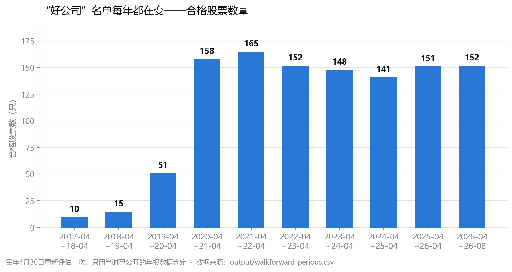
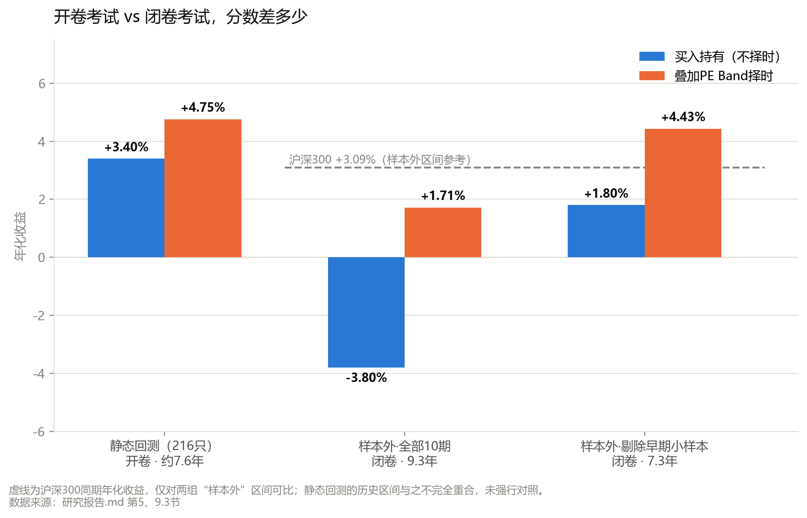

如果你经历过5年前贵州茅台、以及后来各种"药中茅台"的那波行情，应该对"高ROE"这三个字不陌生。那几年，几乎所有卖方研报、公众号回测、甚至量化选股组合，都在做同一件事：把过去10年ROE又高又稳的公司挑出来，做成一个"好公司"池子，然后回测——结果无一例外，都好看得让人心动。

但这些回测有一个共同的、很容易被忽略的毛病：它们几乎都是"以今天为终点"倒推出来的。你今天觉得茅台、片仔癀是好公司，是因为你已经看到了它们过去10年的成绩单——是先知道了答案，才拿着答案去对题。这就好比拿着这次期末考试年级前十名的名单，回头证明"这些学生平时成绩就很好"——这句话当然没错，但它没有任何预测能力，因为你是先看了考试结果，才挑出的这批人。

真正检验一套选股方法有没有用，不能只看它在"已经知道是好学生"的这批人身上表现如何。而要问：如果我回到过去每一个时间点，只用当时已经公开的信息去选股、去决策，这套方法在"当时还不知道结果"的未来里，到底管不管用？这就是"样本外检验"——不是拿着答案对题的开卷考试，而是没见过题目的闭卷考试。

我最近做了一次A股价值股回测，想把这个道理坐实——不是空口讲"以当时为终点的回测不靠谱"，而是拿真实数据、同一套方法，先做一遍开卷考试，再做一遍闭卷考试，看看两者到底能差多少。这篇文章想把这个过程和背后的道理，用尽量通俗的方式讲清楚。

## 二、第一步：先把"开卷考试"做扎实

要证明"开卷考试"的分数不可信，得先老老实实考一次，不能只是嘴上说说。所以我按市面上最常见的做法，认认真真走了一遍流程。

先把"好公司"这三个字量化：过去8-10个完整会计年度，ROE（净资产收益率，通俗理解就是"用股东的钱赚钱的效率"）平均在12%以上，且没有哪一年低于8%——不是看一年成绩好不好，是看一份连续8-10年的成绩单，成绩单里不能有不及格。再剔除几个"体质特殊"的行业：房地产、建筑装饰这类和地产周期强绑定的行业；银行、非银金融，因为它们的高ROE是杠杆撬出来的，不是资产本身回报率高，不能用同一把尺子量；纺织服饰这类偏传统制造的行业也一并排除。

用这套标准，从全市场5535只A股里剔除ST和上市不满8年的次新股，剩下3119只作为研究范围，筛出242只ROE合格的公司，再排除掉特殊行业，最终剩下**216只"好公司"**——注意，这216只是**站在2026年、看着这些公司过去10年的成绩单**选出来的，这一点很关键，后面会用到。

选出候选池之后，配一套同样朴素的买卖规则：把一只股票现在的估值（PE，市盈率）放到它自己过去5年的历史里排位次。现在的估值比过去5年里80%的时间都便宜，就买入；比过去5年里80%的时间都贵，就卖出清仓；其余时候维持原状。可以理解成"历史打折区间买、历史高位卖"，不预测未来，只看相对自己历史便宜不便宜。

光讲规则有点抽象，直接拿开头提到的贵州茅台举个例子——它也在这216只"好公司"名单里：

上半张图是收盘价，下半张图是同一时间的PE历史分位（也就是当天的估值在过去5年里处于什么位置）。可以看到这套规则在茅台身上一共只触发过3次信号：2018年9月估值跌到历史低位买入，2019年4月涨回高位卖出，2022年10月再次跌到低位买入（一直持有到现在）。整个过程不需要判断基本面好不好、行业景气不景气，纯粹是"便宜了就买、贵了就卖"这一条纪律，8年时间只交易了寥寥几次——这也是为什么下一节的216只股票平均下来只有1.8次交易。

## 三、开卷考试的分数：好看到让人心动

拿这216只股票，把上面的规则回测了一遍（覆盖每只股票平均7.6年的历史），结果是：

- PE Band策略年化收益中位数 **4.75%**，买入持有不动只有 **3.40%**
- 65.3%的股票，这套择时规则都跑赢了"买了就不动"
- 平均一只股票8年里只交易1.8次——不是频繁进出，是很克制的低频操作

如果只看到这里，结论会是："一个简单到能写进Excel的规则，在这批好公司身上，稳定跑赢了买入持有。" 这正是开头说的那种回测——好看，而且好看得有道理，因为它是拿着2026年已经知道答案的216家公司，去测2016年以来的历史。**这一步的分数，本质上是一次开卷考试，我知道答案，只是想先让你看看，开卷考试能考多高分。**

## 四、换成闭卷考试：同一套方法，差多少

真正的问题是：如果回到历史上的每一个时间点，只用当时已经公开的信息去挑好公司、去做买卖决策，这套方法在"当时还不知道的未来"里到底管不管用？

做法是：把研究范围从216只扩大回全市场3119只（避免因为"今天已经不在池子里"而漏掉历史上曾经合格的股票），然后设定每年4月30日（差不多是法定年报披露截止日之后）为一个"重新评估时点"。在每个时点，**只用当时已经公开的年报数据**，重新跑一遍同样的筛选标准，选出的名单构成接下来一年的"当期可持有池"——有的股票会因为ROE走弱中途被剔除，也有新股票攒够年报记录后中途加入。

这个名单每年都在变，变化幅度不小：

2017年只有10只股票能通过筛选（因为要求8年以上完整年报，往前倒推到2009年前后就得上市，早期能同时满足的公司很少），到2020年之后才稳定在150只左右。这本身就是对开头那句话最直接的证明：**"好公司"名单不是一份写死的清单，是一个随时间流动的集合，用今天的清单去测过去，测的其实是一份当时根本不存在的名单。**

用这个动态池子重新跑一遍回测，闭卷考试的分数是这样的：

- 算上样本极小的2017-2019年：买入持有年化 **-3.80%**（亏钱），叠加PE Band择时能扭亏为盈到 **+1.71%**，但仍然跑输沪深300的 **+3.09%**
- 剔除掉样本量过小、不具代表性的头两年，只看2019年之后：买入持有转正到 **+1.80%**，但依然跑输指数；PE Band择时达到 **+4.43%**，这才反超了沪深300

两个口径都要摆出来，因为它们讲的是同一件事的两个侧面：**"贵了就卖"这条择时纪律确实持续有效**（两个口径下，择时都比不择时强），但**"选出的这批好公司整体能跑赢大盘"这个预期站不住**——光靠"ROE高且稳定"选股，样本外并不能跑赢沪深300。开卷考试考出4.75%的年化，闭卷考试即便是最乐观的口径也只有4.43%，而且这4.43%里大部分功劳要归给择时纪律，不是选股本身。**开头说的话，到这里算是用数字兑现了。**

## 五、进一步拆开：价值陷阱是怎么发生的

把每年"这次合格、下次被剔除"的股票单独拎出来看，能看到一个很扎心的规律：这些股票在**被剔除之前那一年**（也就是筛选标准还没反应过来的时候），平均收益是 **-14.63%**；而同一时期留下来的股票，平均收益是 **+2.20%**。这个规律在观察到的9个年份里全部成立，没有一次例外。

进一步看，60%的剔除都是因为"单年ROE骤然跌破8%"这条硬指标触发的。这说明一件事：**基本面恶化和股价下跌几乎是同步发生的**，不是股价先跌、基本面后出问题，也不是基本面先出问题、市场后知后觉。问题出在筛选方法本身有一个结构性的滞后——用财报数据做筛选，天然要等一整年的年报正式披露、确认之后，才能反应过来。这一年的滞后期，正是"价值陷阱"吃掉收益的地方：你看到的还是去年那份好看的成绩单，但公司这一年其实已经在走下坡路了，等下一份年报出来确认"确实不行了"，股价往往已经跌完了。

## 六、几条对未来做价值股投资的启示

1. **"好公司"是入场券，不是免死金牌。** 达标只说明这家公司"过去很好"，不代表"现在依然很好"。持仓之后要持续跟踪最新一期业绩相对这家公司自己历史水平的边际变化，而不是建仓时筛一次就躺平。

2. **比"ROE是否还大于8%"更早的信号，是"ROE相对自己历史是不是已经明显往下走了"。** 哪怕绝对值还没跌破警戒线，只要最新一年的ROE明显低于这家公司自己过去的平均水平，就值得提高警惕——这是能提前于硬性门槛察觉问题的信号，也正对应上一节讲的滞后问题：等硬指标触发时往往已经晚了。

3. **别迷信"越便宜越要买"，纪律真正该花在"贵了敢卖"上。** 把买入门槛收得更紧（等更低的价格才买），样本外收益反而是恶化的；真正有效的是卖出端的纪律，而不是死等最低点。

4. **高ROE不等于高质量，要交叉核对杠杆和现金流。** 部分高ROE公司是靠高负债撬出来的，也有部分公司账面利润好看但现金流很难覆盖。只看一个ROE指标不够，至少要看资产负债率/ROA排除杠杆驱动，看自由现金流和净利润的匹配程度排除"利润好看但不来钱"的公司。

## 七、几句诚实的话

这套方法没有考虑交易成本、印花税、滑点；没有做分红再投资调整，用的是价格收益而非全收益，对高股息价值股可能低估了真实回报；覆盖的历史大约9年，只经历了有限的几轮牛熊，结论对未来周期的外推能力有限；用沪深300做基准也不算完全公允，这批股票风格偏价值、低波动，换成中证红利这类风格更接近的指数做对照可能更合适。

但这些局限性都不改变这篇文章想说的那件事：**任何"回头看"选出来的股票组合，拿去测试同一段历史，业绩必然被高估**。不管是自己做选股回测，还是看别人晒出来的漂亮回测曲线，都值得先问一句——这个股票池，是用当时能看到的信息选出来的，还是用今天的信息选出来的？

---

*数据来源：Tushare Pro。完整方法论与逐项数据见同目录下 `研究报告.md`、`总结与投资启示.md`。*
